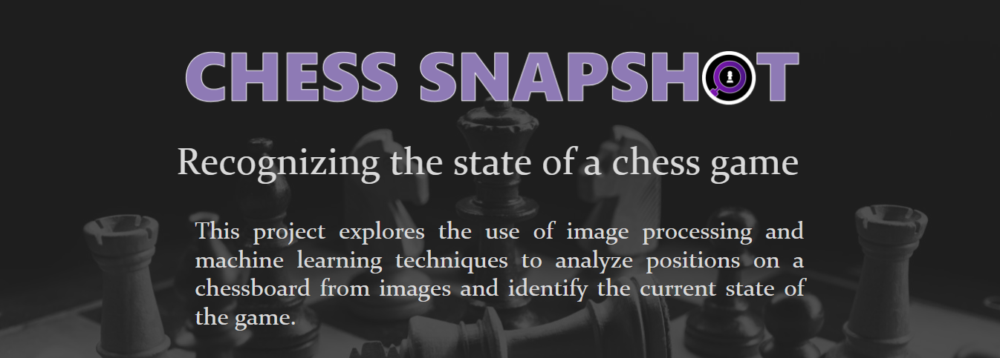
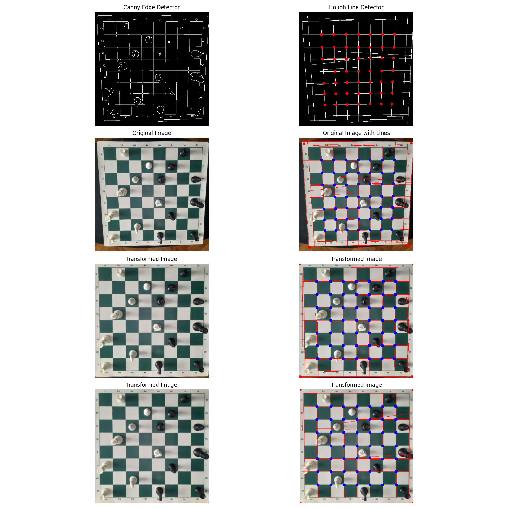

# Chess Position Detector

Chess Position Detector is a Python project designed to detect a chessboard in an image and identify the state of a chess game. The primary purpose of this project is to create a digital record of the chessboard positions using Forsyth-Edwards Notation (FEN), a standard notation for describing a particular board position of a chess game.

## Features

- **Chessboard Detection**: Identifies and accurately detects the chessboard in an image.
- **State Identification**: Analyzes the detected chessboard to determine the position of all pieces.
- **FEN Notation Generation**: Converts the detected board state into Forsyth-Edwards Notation (FEN) for further use.

## How It Works

### Chessboard Detection

The detection process is divided into three main stages:

1. **Detection of Straight Lines**: Using edge detection techniques and Hough transforms, the algorithm identifies straight lines in the image, which are potential chessboard lines.

2. **Intersection Points Detection**: The algorithm locates the intersection points of the detected lines to understand the configuration and placement of the chessboard squares. These point are filtered using a classification model trained using Keras and Tensorflow and [this dataset](https://repod.icm.edu.pl/dataset.xhtml?persistentId=doi:10.18150/repod.7606646).

3. **Chessboard Corners Detection**: These intersection points are then used to determine the chessboard's corners, which are crucial for aligning and transforming the image.

4. **Geometric Transformation**: The final step is to apply a geometric transformation that corrects any perspective distortions, aligning the chessboard accurately within the image. The output is an image with the chessboard and pieces aligned correctly, ready for state identification.

#### Image Representation:



### Chess Piece Detection

The trained model for chess piece detection takes an image resized to 416x416 pixels as input. This resizing maintains the original aspect ratio of the image, avoiding any geometric distortions that could affect piece recognition. The model outputs a list of detection boxes, each box containing the exact coordinates of the piece in the image, as well as the detected class of the piece (e.g., white king, black queen, white pawn, etc.).

#### Dataset

To develop a robust model for chess piece detection, the following datasets were used:

- Chess Pieces Dataset: This existing dataset, available on Roboflow, contains 289 images of various chessboard states with annotated pieces. These images were captured from a single perspective, limiting the variability of scenarios and angles.

- Custom Dataset: To enhance the diversity of the dataset and ensure the model could detect chess pieces in various conditions and from multiple perspectives, an additional set of 350 images was created. These images feature a real chessboard and pieces, photographed from different angles and distances. The images were annotated to indicate the positions and types of chess pieces.

- Digital Chessboards: To extend the model's capabilities to recognize chess pieces on digital boards, 10 images of 2D virtual chessboards were included. These images were captured from popular online chess platforms like Chess.com and Lichess.com. Including these digital images ensures that the model can be applied to online chess games, where the design and graphical representation of the pieces can vary significantly.

#### Image Representation:


### Game State Detection

To determine the exact square where each piece is located on the grid, the midpoint of the bottom edge of the detection box for each detected piece (the point centered between the bottom left and right corners) is used as the piece's location on the original image. This method is chosen because, when viewed from an angle, the tops of the pieces often overlap or fall into other squares on the grid. By selecting the bottom of the piece, the piece's location will always correspond to the square on which it actually stands.

**FEN Generation:** The final step involves generating the Forsyth-Edwards Notation (FEN) based on the detected positions of the pieces on the chessboard.

#### Image Representation:


## Installation

### Prerequisites

- Python 3.10

### Requirements

Ensure that you have Python installed on your machine. You can install the necessary dependencies using `pip` and the `requirements.txt` file.

```bash
pip install -r requirements.txt
```

#### Dependencies

- OpenCV
- Numpy
- Matplotlib
- ...

These dependencies are necessary for image processing, detection algorithms, and visualization.

## Usage

To use the `ChessboardDetector`, follow these steps:

1. Import the necessary classes and functions:

   ```python
   from chessboard_detector import ChessboardDetector
   ```

2. Initialize the detector and run the detection:

   ```python
    chess_position_detector = ChessPositionDetector()
    fen = chess_position_detector.detect(original_image)
   ```

3. The `detect` method returns a fen string with the position detected.

**Example** run at [`chess-position-detector.ipynb`](chess-position-detector.ipynb).

## Acknowledgments

The project is based on advanced computer vision techniques and was supervised by Lect. Dr. Ioana Cristina Plajer.

**Read More:** [Chess Snapshot Full Documentation in Romanian (PDF)](ChessSnapshot.pdf)
